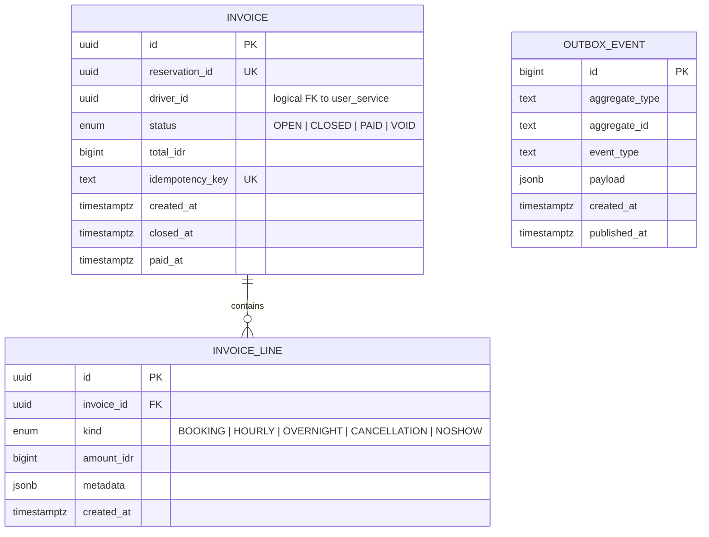

# ERD — billing-service

## Why append-only line items

Audit trail. We never mutate or delete a line — corrections are new lines (e.g.
a refund line with negative amount). The invoice `total_idr` is denormalised
for query speed but always equals `SUM(invoice_line.amount_idr)`.
